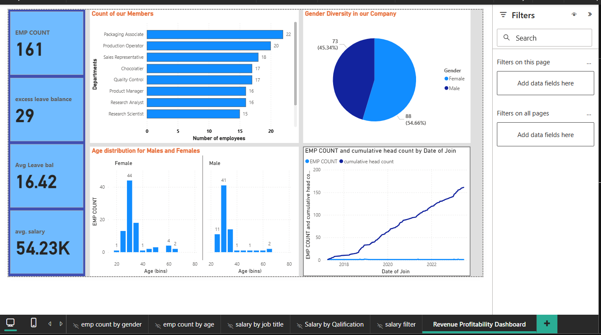
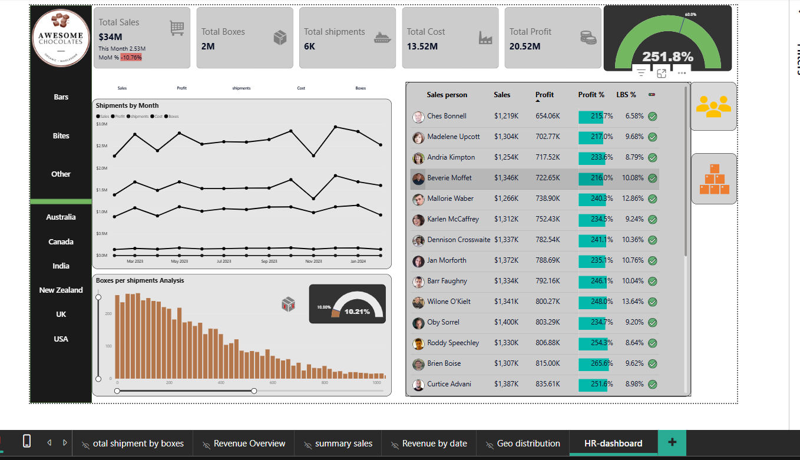

# Power BI Dashboards

This repository contains screenshots and documentation for the Power BI dashboards.

---

## 📊 Revenue Profitability Dashboard

The **Revenue Profitability Dashboard** is designed to provide insights into an organization’s financial performance.  
It helps track revenue growth, profitability, key financial KPIs, and forecasting trends.  
The dashboard supports data-driven decisions by highlighting areas of strong performance and spotting potential risks.

---

## 👥 HR & Workforce Analytics Dashboard

The **HR & Workforce Analytics Dashboard** focuses on employee and workforce data.  
It provides insights into workforce distribution, hiring trends, attrition, and employee engagement.  
The dashboard helps HR teams monitor workforce metrics, improve retention strategies, and align workforce planning with business goals.

